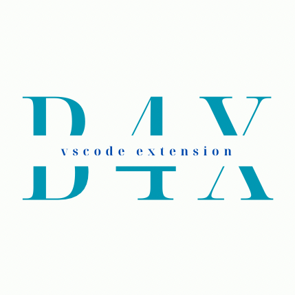

# B4X 语言支持 - VSCode 扩展

为 B4X（B4A，B4i以及B4J 等）提供语法高亮、代码片段和基础语言支持的 Visual Studio Code 扩展（当前版本功能有限，后续会逐步增强）。

## 当前版本
- Version: 0.1.3

## 功能
- **语法高亮**：支持 `.bas` 文件的 B4X 语法着色。
- **代码片段**：快速插入常用 B4X 代码结构。
- **语言配置**：自动括号匹配、注释切换等基础支持。
- **语言服务**：定义跳转，悬停提示，引用查找，自动补全，签名帮助。

## 安装
1. 打开 VSCode。
2. 按下 `Ctrl+Shift+X`（或点击侧边栏扩展图标）。
3. 搜索 `B4X`，找到扩展后点击安装。

## 使用方法
- 直接打开 `.bas` 文件即可生效。

## 问题反馈
遇到问题？请提交到 [GitHub Issues](https://github.com/Jansen611/b4x-language-support/issues)。

## 许可证
MIT © [Jansen](https://github.com/Jansen611)
