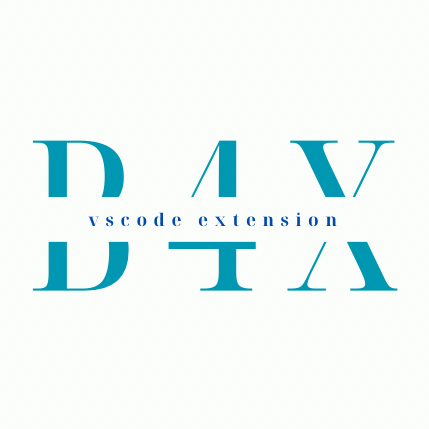

# B4X 语言支持 - VSCode 扩展

[English](./README.md) | [中文](./README_CN.md)

为 B4X（B4A、B4i、B4J）在 Visual Studio Code 中提供增强的语言支持，包含完整的可视化布局设计器。

## 功能

### B4X 语言服务
- **语法高亮**：支持 `.bas`、`.b4a`、`.b4i`、`.b4j` 文件的完整语法着色。
- **代码片段**：快速插入常用 B4X 代码结构。
- **语言配置**：括号匹配、注释切换、自动缩进。
- **定义跳转**：跳转到变量、Sub 及成员的声明位置。
- **悬停提示**：悬停时显示类型信息和作用域（全局/局部/参数）。
- **引用查找**：查找符号的所有引用位置。
- **自动补全**：关键字、变量、函数以及基础类成员（如 `List.Add`、`Map.Put`、`String.Length`）的自动补全。
- **签名帮助**：输入 `(` 或 `,` 时显示函数签名提示。
- **自动闭合语句**：输入 `If` 自动插入 `End If`，输入 `For` 自动插入 `Next`，等等。

### 集成化 B4X 布局视图
- **可视化布局编辑器**：在可视化设计画布中打开 `.bil`（B4i）、`.bjl`（B4J）和 `.bal`（B4A）文件，支持拖拽、调整大小、选择、缩放和平移。
- **视图树**：侧边栏面板显示完整控件层级结构，支持搜索、多选、键盘导航以及拖拽重新父化到容器视图。
- **属性面板**：侧边栏面板，用于编辑控件属性（名称、位置、大小、锚点等），提供平台专属编辑器。
- **多屏幕变体支持**：管理屏幕尺寸变体——手机、平板、竖屏、横屏——提供预定义布局和最佳匹配算法。可动态添加/删除/切换变体。
- **设计器脚本引擎**：运行 B4X 方言设计器脚本（如 `AutoScaleAll`、`AutoScaleRate`），根据不同变体自动调整控件位置和尺寸。
- **自定义视图支持**：通过 `b4x.libraryPaths` 设置从 B4X 库 XML 描述文件中加载自定义视图。自定义视图会出现在 **添加视图 > CustomView** 菜单中。
- **剪贴板操作**：支持复制、剪切、粘贴和复制控件的标准快捷键（Ctrl/Cmd+C/X/V/D）。
- **代码生成**：从设计器直接将 `Dim` 声明和事件 `Sub` 处理程序插入到关联的 `.bas` 源文件中。
- **新建布局文件**：通过 `B4X: New Layout File...` 命令创建新的 `.bil`/`.bjl`/`.bal` 布局文件。自动发现工作区中的 B4A/B4i/B4J 项目。

### AI Agent CLI 工具
- **`b4x-cli`**：自动在集成终端中可用的 CLI 工具，用于在二进制格式（`.bil`/`.bjl`/`.bal`）和 JSON 格式之间转换布局文件——专为 AI Agent 使用而设计。
  - `b4x-cli to-json <layout>` — 二进制转 JSON
  - `b4x-cli from-json <json> -o <layout>` — JSON 转二进制

## 安装
1. 打开 VSCode。
2. 按下 `Ctrl+Shift+X`（或点击侧边栏扩展图标）。
3. 搜索 `B4X`，找到扩展后点击安装。

## 问题反馈
遇到问题？请提交到 [GitHub Issues](https://github.com/Jansen611/b4x-language-support/issues)。

## 鸣谢
- **Anywhere Software**：感谢其创建了 [B4X 开发工具](https://www.b4x.com/)，并持续维护 [B4X 开发者社区](https://www.b4x.com/android/forum/)。

## 许可证
MIT © [Jansen](https://github.com/Jansen611)
